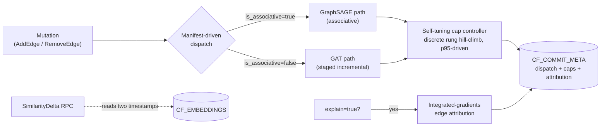
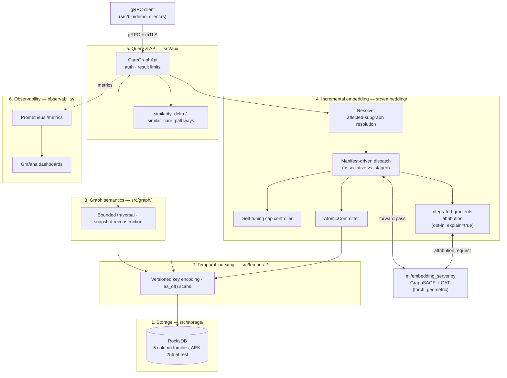
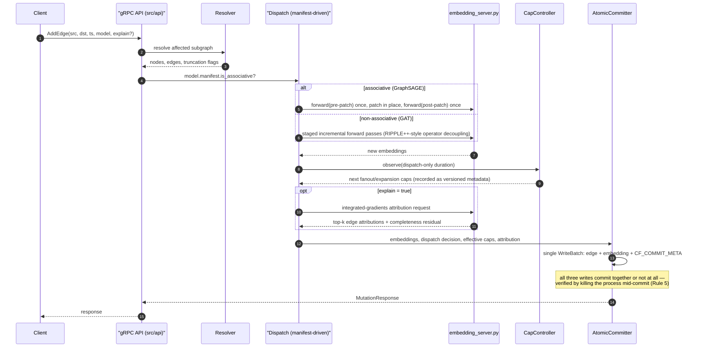

# CareGraph

A temporally-versioned graph database with incrementally-maintained GNN embeddings.

Graph mutations and their resulting embedding updates commit atomically inside a
single RocksDB `WriteBatch`, so both graph structure and embeddings are queryable
at any historical point in time. Embeddings are a first-class versioned field,
not a batch-computed side artifact.

### Contents

- [Features](#features)
- [Getting started](#getting-started)
  - [One-command setup](#one-command-setup)
  - [Configuration](#configuration)
  - [Loading the clinical graph](#loading-the-clinical-graph)
  - [Live demo](#live-demo)
- [Architecture](#architecture)
  - [Component diagram](#component-diagram)
  - [Mutation lifecycle](#mutation-lifecycle)
  - [Column families](#column-families)
  - [Deletions are tombstones](#deletions-are-tombstones)
- [The ten non-negotiable rules](#the-ten-non-negotiable-rules)
- [Repository layout](#repository-layout)
- [License](#license)

---

## Features

All numbers below are measured on the real 174,298-node / 515,117-edge
Diabetes 130 clinical graph — see `docs/benchmark_report.md` for full
methodology, baselines, and disclosed limitations.

- **Temporally-versioned graph storage** — every node/edge mutation is
  appended, never overwritten. Point-in-time reads (`as_of`) are a single
  RocksDB seek thanks to bit-inverted timestamp keys — no reverse iterator,
  no secondary index (see [Column families](#column-families)).
- **Incrementally-maintained GNN embeddings** — GraphSAGE and GAT embeddings
  update in the same atomic commit as the structural mutation that changed
  them, not in a separate batch job.
- **Atomic mutation + embedding commit** — the structural edge, its
  embedding, and its provenance record land in one RocksDB `WriteBatch`.
  Verified by killing the committing process at a randomised point across
  100 iterations on both dispatch paths: zero non-atomic states observed.
- **Architecture-agnostic dispatch** — each deployed model's manifest states
  whether its aggregation is associative (fast in-place patch, e.g.
  GraphSAGE's mean) or not (staged incremental recompute, e.g. GAT's
  attention). The engine reads that instead of hardcoding per-architecture
  logic, and cross-checks it against the running checkpoint at spawn time.
- **Self-tuning incremental-update boundary** — a discrete cap controller
  hill-climbs the affected-subgraph size limits against a live p95 latency
  target, recording every adjustment as versioned metadata alongside the
  mutation it affected.
- **Explainable delta attribution** — optional (`explain: true`)
  integrated-gradients attribution reports which edges drove an embedding
  change and by how much, committed atomically with the embedding itself so
  it stays queryable at any point in time rather than just logged in passing.
- **Point-in-time similarity queries** — `similar_care_pathways` for a
  single-timestamp nearest-neighbor search, plus `SimilarityDelta` for "how
  much did X's similarity to Y change between two timestamps."
- **Bounded graph traversal & snapshot reconstruction** — k-hop neighborhood
  queries and full-graph state reconstruction at any historical timestamp.
- **Real encryption at rest + mutual TLS** — AES-256 via a from-scratch
  RocksDB encryption shim, and mTLS on the gRPC listener; both opt-in via
  environment variables and fail-loud (never silently downgraded) when
  misconfigured.
- **Observability** — Prometheus metrics and a Grafana dashboard for the
  query and mutation paths, including per-dispatch-path latency breakdowns.
- **Benchmarked against real baselines** — a three-way harness runs the same
  trace against CareGraph, Neo4j + GDS, and TerminusDB.

### Dispatch, self-tuning, and attribution at a glance



| Feature | What it does | Measured result |
|---------|--------------|------------------|
| Manifest-driven dispatch | Reads each model's `is_associative`/`architecture` from its manifest instead of a hardcoded `match`; cross-checks the running checkpoint at spawn time | Closes a real, previously-unchecked model/manifest mismatch footgun |
| Self-tuning cap controller | Discrete 5-rung hill-climb over `(fanout, max_expanded_nodes)`, driven by a live p95, recorded as versioned metadata | 1.46x p95 reduction (1165.53ms → 799.55ms) — real but modest, see `docs/benchmark_report.md` §2.7 |
| Integrated-gradients attribution | Per-request opt-in (`explain: true`) edge attribution, committed atomically with the embedding it explains | Completeness identity verified with zero failures on both architectures; real overhead is 100-300x an early estimate at full-graph scale, see `docs/benchmark_report.md` §2.6 |
| `SimilarityDelta` RPC | "How much did patient X's similarity to Y change between T1 and T2?" — a two-timestamp query, not a single snapshot | p50 0.056ms / p95 0.065ms on the full graph |

## Getting started

### One-command setup

```bash
docker compose -f infrastructure/docker-compose/dev-stack.yml up --build
```

This starts CareGraph alongside the two baseline systems that Rule 4 requires
benchmarks to run against — Neo4j Community + GDS, and TerminusDB — plus
Prometheus and Grafana. It configures everything for you; no environment
variables to set by hand.

To work outside Docker you need Rust, and a C++ toolchain for RocksDB. See
[docs/TOOLCHAIN.md](docs/TOOLCHAIN.md) for platform-specific setup.

```bash
cargo build
cargo test --lib              # unit tests
cargo test --test integration # against a real on-disk RocksDB
bash scripts/check_rules.sh   # Section 0 rule enforcement
bash scripts/run_demo.sh      # live end-to-end demo, see below
```

### Configuration

Running the `caregraph` binary directly (outside Docker Compose) needs
exactly one environment variable:

| Variable | Why it's required |
|----------|--------------------|
| `CAREGRAPH_API_KEY` | Bearer token checked on every gRPC call by the auth interceptor. Unset means the server **refuses to start** rather than serving with auth silently disabled (Rule 2). Generate one with `openssl rand -hex 32`. |

Everything else — listener addresses, which model to load, encryption,
mTLS, attribution step count — has a working default and only needs to be
touched for non-default behavior. See `src/main.rs` for the full list if
you need to change one.

### Loading the clinical graph

The PRD names the IDPIP UKPDS-derived clinical graph (5,102 T2DM patients,
20-year follow-up) as the evaluation dataset; that source isn't reachable in
this environment, so every trace, benchmark, and demo in this repository
actually runs on the **Diabetes 130-US Hospitals** dataset (UCI id 296)
instead — a real, cited, public substitute, not synthetic data. Use this
path to reproduce anything in `docs/benchmark_report.md` or
`scripts/run_demo.sh`:

```bash
python data/diabetes130_loader.py \
    --csv data/raw/diabetic_data.csv \
    --out benchmarks/traces/diabetes130_full.jsonl

cargo run --release --bin caregraph-load -- \
    --trace benchmarks/traces/diabetes130_full.jsonl \
    --db data/db/diabetes130
```

`data/diabetes130_loader.py`'s own module doc lists exactly what is derived
rather than read verbatim from the source file (encounter dates, provider
identity) — read it before citing a number from this data (Rule 6).

If IDPIP's TimescaleDB source becomes reachable, `data/idpip_ukpds_loader.py`
implements the loader the PRD actually names, producing a byte-identical
trace format so the same `caregraph-load` command and the same three-way
Neo4j/TerminusDB comparison apply unchanged:

```bash
export IDPIP_DATABASE_URL='postgresql://user@host:5432/idpip'
python data/idpip_ukpds_loader.py --limit-patients 100 \
    --out benchmarks/traces/ukpds_smoke_100.jsonl

cargo run --release --bin caregraph-load -- \
    --trace benchmarks/traces/ukpds_smoke_100.jsonl \
    --db data/db/caregraph
```

**Neither loader has a synthetic mode.** Both exit non-zero if they cannot
reach their real source (Rule 6). A benchmark measured on invented data is
not a measurement.

### Live demo

```bash
bash scripts/run_demo.sh
```

One command, no manual steps, safe to re-run. It seeds a fresh database from
a real slice of the Diabetes 130 trace, then replays that slice's final three
patient encounters live over gRPC instead of through the bulk loader — each
one committing its structural edge and its GraphSAGE embedding update
atomically (Rule 5) — and walks through bounded traversal, a before/after
point-in-time snapshot across those live mutations, and point-in-time
similarity search against the embeddings they just produced. See
[docs/api_reference.md](docs/api_reference.md) for what each RPC does, and
`src/bin/demo_client.rs` for the real client code the script drives.

## Architecture

Six layers, each reachable only through its defined interface.

| Layer | Module | Responsibility |
|-------|--------|----------------|
| 1. Storage | `src/storage/` | RocksDB, column families, WAL durability |
| 2. Temporal indexing | `src/temporal/` | Versioned key encoding, point-in-time scans |
| 3. Graph semantics | `src/graph/` | Bounded traversal, snapshot reconstruction |
| 4. Incremental embedding | `src/embedding/` | Affected-subgraph resolution, atomic commit |
| 5. Query & API | `src/api/` | gRPC service, auth, result limits |
| 6. Observability | `observability/` | Prometheus, Grafana, benchmark harness |

### Component diagram



### Mutation lifecycle

What actually happens inside one `AddEdge`/`RemoveEdge` call — the path that
Rule 5 (atomicity) and Rule 7 (no silent fallback) are enforced against.



### Column families

| CF | Key | Value |
|----|-----|-------|
| `CF_EDGES` | `[src_id \| edge_type \| ts_desc \| dst_id]` | edge properties |
| `CF_REVERSE` | same, src/dst swapped | edge properties |
| `CF_NODES` | `[node_id \| ts_desc]` | node properties |
| `CF_EMBEDDINGS` | `[node_id \| ts_desc]` | vector + model_id + computation_path |
| `CF_COMMIT_META` | `[node_id \| ts_desc]` | dispatch decision + effective caps + attribution |

Timestamps are stored bit-inverted, so a *newer* version produces a *smaller*
byte sequence and sorts first. A point-in-time read is therefore a single
forward seek — no reverse iterator, no secondary index. That is the mechanism
behind O(log n) point-in-time retrieval:

```
CF_EMBEDDINGS, node 42, three versions written at T1 < T2 < T3
(ts stored as !T — bitwise NOT — so byte order sorts newest first)

  key: [42 | !T3]  ─┐  smallest byte sequence → seek() lands here first
  key: [42 | !T2]   ├─ RocksDB forward-iteration order
  key: [42 | !T1]  ─┘  largest byte sequence  → sorts last

  as_of(node=42, T=T2.5):
      seek(key = [42 | !T2.5])
        └──▶ first key ≥ target is [42 | !T2]   (one seek, no scan back)
```

Note that edge keys order by timestamp *before* `dst_id`, so within one
adjacency list the versions of different destinations are interleaved in time.
That is what makes a time-windowed scan ("every change to this patient's
diagnoses between T1 and T2") a single contiguous key range. The trade-off is
that reconstructing a full adjacency list at a timestamp costs a walk over the
list's version history rather than a seek per edge — see the module docs on
`src/temporal/index.rs`.

### Deletions are tombstones

A removal appends a version marked `deleted`, never a RocksDB `delete`.
Erasing the key would erase the history that point-in-time reconstruction
reads, making `as_of(T)` for a `T` before the removal wrongly report that the
edge never existed. The timeline is append-only.

## The ten non-negotiable rules

`scripts/check_rules.sh` continuously enforces ten invariants — real storage
(no mocks), real trained models (no random vectors), atomic commits, no
silent fallback to full recompute, real encryption, no placeholder
dashboards, and benchmark-cited claims among them. Every rule reports
`PASS`, `FAIL`, or `PENDING`; `PENDING` means the feature it covers hasn't
been built yet in a from-scratch build.

```bash
bash scripts/check_rules.sh            # report everything
bash scripts/check_rules.sh --phase 3  # gate: phase-3 rules must be live
bash scripts/check_rules.sh --rule 5   # one rule
```

`PENDING` is deliberately loud and never silent. Rule 10 has been retired for
this project and always reports `RETIRED`; rules 1-9 remain fully enforced.

## Repository layout

```
src/            Rust core — storage, temporal, graph, embedding, api
proto/          gRPC schema
data/           UKPDS loader and clinical graph schema
ml/             GNN training and incremental-update reference
benchmarks/     Baseline harness and mutation traces
observability/  Prometheus rules, Grafana provisioning
infrastructure/ Docker Compose dev stack
scripts/        check_rules.sh, run_demo.sh
tests/          integration/, unit/, fault_injection/
docs/           Design notes, benchmark reports, API reference
```

## License

Apache-2.0. Clinical data is **not** covered by this license and is never
committed to this repository.
